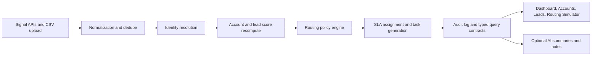

# GTM Signal Orchestrator

## One-line Summary

Deterministic GTM signal ingestion, scoring, routing, SLA tracking, and operator workflows in a local-first Next.js workspace.

## Why This Matters In GTM

Revenue systems break down when signal capture, identity resolution, lead routing, and follow-up accountability live in different places. This project keeps trust-critical decisions deterministic and inspectable: every score change, routing outcome, SLA deadline, and generated task is persisted with reason codes and audit history.

## Core Capabilities

- Ingest signals through `POST /api/signals` or batch CSV upload through `POST /api/signals/upload`.
- Normalize payloads, deduplicate events, and resolve accounts and contacts before decisions are made.
- Recompute account and lead scores with stable component caps, canonical reason codes, and persisted score history.
- Route active leads through deterministic precedence rules with queue assignment, owner fallback, and explicit routing explanations.
- Assign lead and task SLAs with concrete deadlines, tracked states, and breach detection.
- Generate operator tasks and action recommendations with linked trigger metadata and audit trails.
- Serve read-only operator views for `/dashboard`, `/accounts`, `/accounts/[id]`, `/leads`, and `/routing-simulator`.
- Layer optional AI summaries and action notes on top of the deterministic system without changing the source-of-truth decision path.

## Architecture Diagram



Expanded notes: [docs/architecture.md](/Users/mohit/GTM-Signal-Orchestrator/docs/architecture.md)

## Demo Screenshots / GIFs

- `docs/demo-assets/01-dashboard-overview.png` - dashboard KPI cards, SLA health, and routing feed.
- `docs/demo-assets/02-request-demo-ingest.png` - terminal or API client posting a `request_demo` signal.
- `docs/demo-assets/03-atlas-grid-account-detail.png` - Atlas Grid account detail with score, tasks, and audit sections.
- `docs/demo-assets/04-routing-simulator.png` - routing simulator result with precedence explanation.
- `docs/demo-assets/05-dashboard-closeout.png` - closing dashboard frame with measurable outcomes visible.
- `docs/demo-assets/urgent-inbound-flow.gif` - optional short loop of the ingest-to-account-detail flow.

Capture guidance: [docs/screenshots.md](/Users/mohit/GTM-Signal-Orchestrator/docs/screenshots.md)

## Example Workflow

1. Open `/dashboard` to show hot account count, SLA health, and recent routing decisions.
2. Post a `request_demo` signal to `POST /api/signals` for the Atlas Grid scenario.
3. Open `/accounts/acc_atlas_grid` to inspect the score breakdown, open tasks, and audit log.
4. Call `GET /api/leads/acc_atlas_grid_lead_01` to show the routed owner, queue, and SLA deadline for the lead contract.
5. Open `/routing-simulator` to show how the same policy engine explains precedence and fallback behavior without writing data.

Demo walkthrough: [docs/demo-script.md](/Users/mohit/GTM-Signal-Orchestrator/docs/demo-script.md)

## Tech Stack

- Next.js 16 App Router
- TypeScript
- Prisma 7
- SQLite with `better-sqlite3`
- React 19
- Tailwind CSS 4
- Recharts
- Node test runner with `tsx`

## Local Setup

1. Install dependencies.

   ```bash
   npm install
   ```

2. Validate the Prisma schema.

   ```bash
   npm run db:validate
   ```

3. Apply migrations and load the seeded workspace.

   ```bash
   npm run db:migrate
   npm run db:seed
   ```

4. Start the app.

   ```bash
   npm run dev
   ```

5. Open [http://localhost:3000/dashboard](http://localhost:3000/dashboard).

Optional AI provider configuration:

```bash
AI_PROVIDER=openai
OPENAI_API_KEY=your-key
OPENAI_MODEL=your-model
```

Useful verification commands:

- `npm test`
- `npm run db:verify-contracts`
- `npm run db:verify-routing`
- `npm run db:verify-signal-pipeline`
- `npm run db:verify-sla`

## Sample Data

The fresh seed creates a reproducible demo workspace with:

- 12 users
- 20 accounts
- 40 contacts
- 30 leads
- 120+ signal events
- 30+ routing decisions
- seeded tasks, action recommendations, score history, SLA events, and audit logs

Canonical seeded scenarios:

- Atlas Grid Systems - hot inbound `request_demo` flow with routing, SLA tracking, follow-up tasks, and audit history.
- BeaconOps Partners - pricing and product-usage signals that drive score and routing changes.
- Unmatched queue - 10+ unmatched signals for ops review and identity triage.

## How Scoring Works

Scoring is deterministic and component-based. Account and lead scores are built from the same capped component model, then persisted as snapshots and score-history rows with machine-readable reason codes and display-ready reason details.

- Account components: `fit`, `intent`, `engagement`, `recency`, `productUsage`, `manualPriority`.
- Default component caps are fixed in code: fit `25`, intent `20`, engagement `25`, recency `10`, product usage `15`, manual priority `5`.
- Lead scoring inherits part of the parent account context instead of blindly copying account scores. The fit inheritance path is explicitly tested and discounted.
- Every persisted recompute stores ordered reason metadata so the UI and audit surfaces can explain why the score moved.

## How Routing Works

Routing uses explicit precedence rules rather than opaque model output. The current engine evaluates the same policy path in production routing and in the simulator.

- Named account owner
- Existing owner preservation
- Strategic tier override
- Territory and segment rule
- Round-robin pool fallback
- Ops review queue when no eligible owner remains

Each routing decision carries:

- decision type
- assigned owner or explicit ops-review fallback
- queue
- normalized explanation text
- top-level reason codes
- evaluated policy-step diagnostics
- SLA policy and due time

## AI Assist Design

AI is optional and read-only.

- Provider selection is environment-driven and currently supports an OpenAI provider plus a deterministic noop fallback.
- If AI is disabled or misconfigured, the APIs still return stable contracts with `status: "unavailable"` and deterministic fallback text.
- AI output is limited to contextual summaries and action notes.
- Deterministic scoring, routing, task generation, SLA tracking, and audit history remain the source of truth.

## Tradeoffs And Future Improvements

Implemented today:

- deterministic backend decisioning with typed contracts for the main operator views
- API-driven signal ingestion and route-handler coverage for core flows
- read-only UI surfaces that explain current state without exposing mutation-heavy admin tooling

Future improvements:

- richer unmatched-signal resolution workflows
- deeper lead and task detail pages in the UI
- policy editing and version history beyond the current simulator and rule snapshots
- broader external adapters beyond the seeded local demo sources

## Business Impact Metrics

These are demo scenario metrics derived from seeded sample data. They are useful for understanding the workflow, but they are not production claims.

- Average speed-to-lead improvement: `91%` benchmarked against labeled demo scenarios.
- Urgent-score meeting conversion lift: `211%` versus non-urgent score buckets.
- Manual routing effort reduction: `97%` of routed workload stays out of the ops-review queue in the seeded window.
- Unassigned inbound lead reduction: `97%` versus a manual baseline where new inbound work starts unassigned.

Implementation details and test boundaries:

- [docs/architecture.md](/Users/mohit/GTM-Signal-Orchestrator/docs/architecture.md)
- [docs/demo-script.md](/Users/mohit/GTM-Signal-Orchestrator/docs/demo-script.md)
- [docs/screenshots.md](/Users/mohit/GTM-Signal-Orchestrator/docs/screenshots.md)
- [docs/testing.md](/Users/mohit/GTM-Signal-Orchestrator/docs/testing.md)
