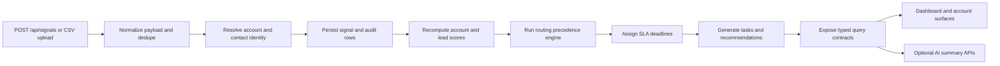

# Architecture

## Request Path

Signals enter through `POST /api/signals` for single-event ingestion or `POST /api/signals/upload` for CSV batches. The pipeline normalizes source fields, computes a dedupe key, resolves identity, persists the signal, writes audit rows, recomputes scores, routes active leads, and then creates downstream SLA and action artifacts.

## Decision Path

The trust-critical path is deterministic:

- scoring recompute uses capped components and canonical reason codes
- routing uses explicit precedence with queue fallback and owner-capacity checks
- SLA assignment maps lead and task context to fixed policy keys and due times
- task generation ties every action back to the triggering score history and routing decision when available

The routing simulator uses the same policy engine as persisted routing decisions, but it does not write data.

## Trust Model

This system favors inspectability over novelty.

- deterministic scoring, routing, SLA assignment, and action generation are the source of truth
- every decision path emits reason codes and audit entries
- AI is optional and only produces read-only summaries or contextual notes
- the noop provider keeps the AI contracts stable even when no external model is configured

## Current UI Surface Vs Backend Surface

Current UI is strongest in:

- `/dashboard`
- `/accounts`
- `/accounts/[id]`
- `/leads`
- `/routing-simulator`

Backend surfaces go deeper than the UI today:

- signal ingestion is API-driven, not form-driven in the workspace UI
- lead detail is available through `GET /api/leads/[id]`
- CSV ingestion is available through `POST /api/signals/upload`
- dashboard and account detail views are backed by typed query contracts rather than direct client-side data shaping
